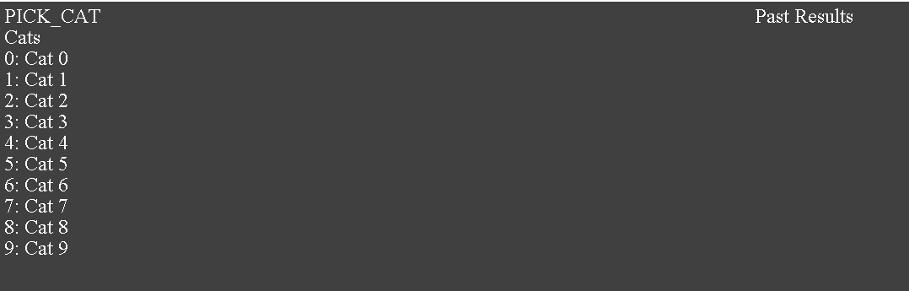

# Cat Genetics - Proof of Concept

Written in one 8-hour car ride in a fever dream. I'm pretty sure the idea came from an interview from the developer of Binding of Issac on one of his canceled games.

A list of cats is generated with a random element (fire, wind, lighting, earth, water). The user isn't told what each cat is. The user can then select a cat (using 0-9) and test the cat against another element. 

The combination result can then give you a hint at which element the cat is (assuming the element doesn't kill the cat). You can also mate cats to create new cats with combination elements. The combo results are determined about how the elements interact.

Finished Mechanics:
* Random Generation - Generate a random element for each cat
* Select Cat - Select a cat to test against another element
* List of past results
* Combination - Determine the combination of the two elements by mating two cats

## Combination Results
Heavily inspired by Naruto elements.

* Fire + Wind = Scorch
* Fire + Water = Boil
* Fire + Earth = Lava
* Fire + Lightning = Blaze

* Wind + Earth = Poison
* Wind + Lightning = Swift
* Wind + Water = Ice

* Lightning + Water = Storm
* Lighting + earth = Explosion

* Earth + Water = Wood

