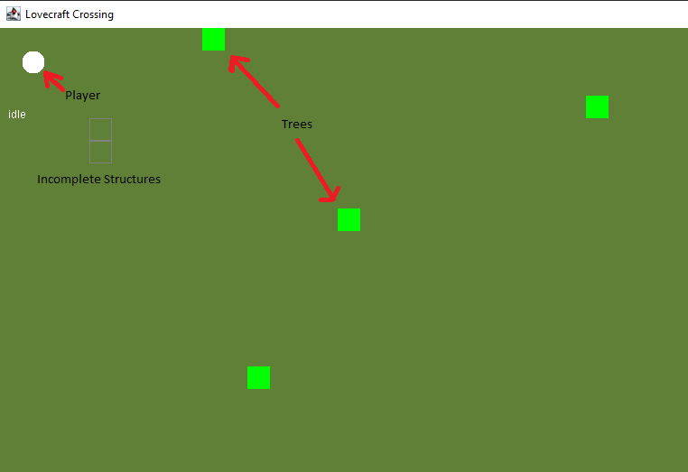
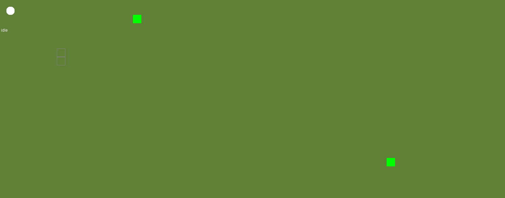
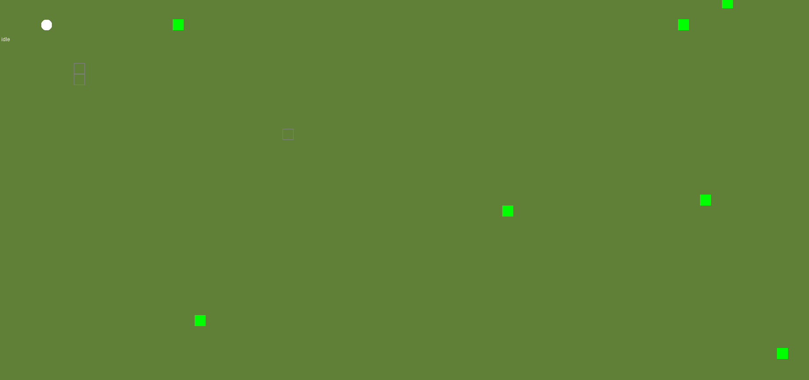
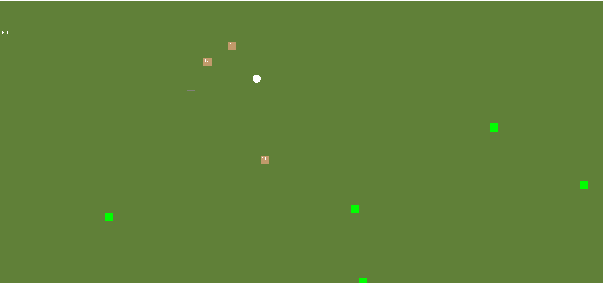
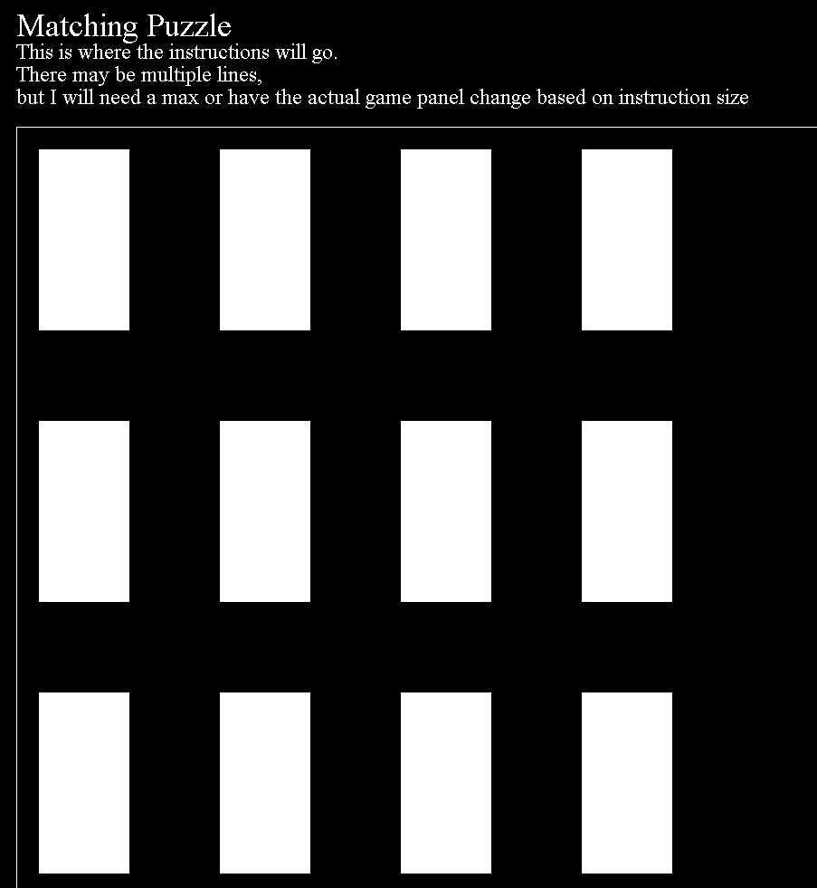
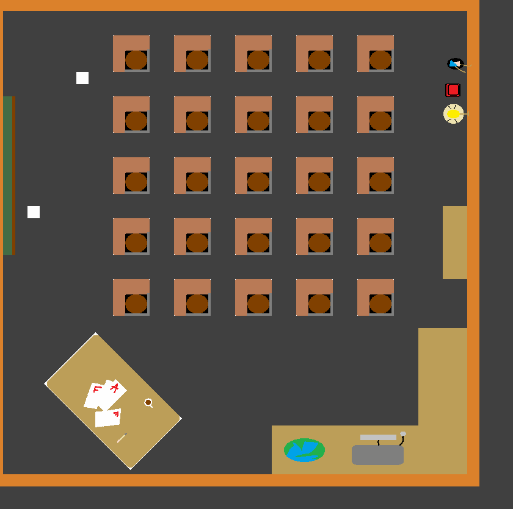
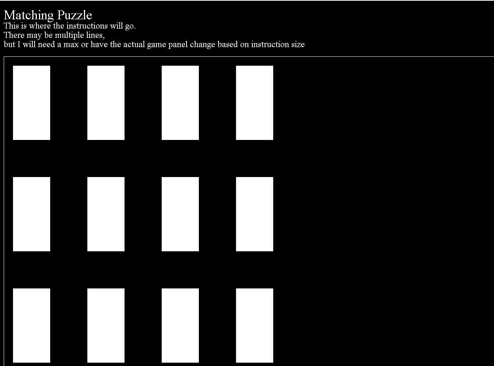

# Java-Game-Dev-Projects
Older game dev projects I have worked on. Most are small proof of concepts of mechanics. Each has a small description and preview of what I worked on.

# Lovecraft Crossing

My first attempt at a complex game mechanics. I envisioned a game with mechanics as a cross between Animal Crossing and Rim World. For this project, I specifically looked at recreating Rim World-like mechanics.

You can't directly control  your player, but you can select where you want to move. You can only move to a tile that is not occupied by another player. You can also give direct commands to your player like "cut trees' or "build" and the player will automatically execute those commands.

For this proof of concept, you are able to:
* Tell the player where to move
* Tell the player to cut trees
* Set buildings and tell the player to build them (given a certain amount of resources)

Mechanics:
* Pathfinding - A* algorithm
* Prioritized Queue - Priority queue for pathfinding
* Automatic Execution - Automatically execute commands until unable or finished
* Build buildings - The user can set up structures then implement a build command where the player will collect the resources needed for the building and go build it.
* Cut trees - The user can set up a cut tree command and collect resources
* Resource Management - The user can set buildings, but the player will only build if he has enough resources.
* Random Enviroment - The trees are randomly seeded.

Directions
* Right Mouse - Select place to move
* Left Mouse - Select place to build
* 'c' - Cut trees Command
* 'b' - Build Command

## Movement

## Cut Trees

## Building

# Cat Genetics - Proof of Concept

Written in one 8-hour car ride in a fever dream. I'm pretty sure the idea came from an interview from the developer of Binding of Issac on one of his canceled games.

A list of cats is generated with a random element (fire, wind, lighting, earth, water). The user isn't told what each cat is. The user can then select a cat (using 0-9) and test the cat against another element. 

The combination result can then give you a hint at which element the cat is (assuming the element doesn't kill the cat). You can also mate cats to create new cats with combination elements. The combo results are determined about how the elements interact.

Finished Mechanics:
* Random Generation - Generate a random element for each cat
* Select Cat - Select a cat to test against another element
* List of past results
* Combination - Determine the combination of the two elements by mating two cats

## Combination Results
Heavily inspired by Naruto elements.

* Fire + Wind = Scorch
* Fire + Water = Boil
* Fire + Earth = Lava
* Fire + Lightning = Blaze

* Wind + Earth = Poison
* Wind + Lightning = Swift
* Wind + Water = Ice

* Lightning + Water = Storm
* Lighting + earth = Explosion

* Earth + Water = Wood

# Mistborn Proof of Concept

This is a small proof of concept with several mechanics from the fantasy series Mistborn.

Small 2-D Platformer built in pure java. 

Mechanics:
* Collision
* Gravity
* Jumping/Movement

# Puzzle - Matching Game

I wanted to create a very simple game in pure java in order to understand the basics of a gameplay loop and basic game engine.

This is a very simple memory matching game. The cards are flipped over and the player has to match the two cards.

**Note:** I'm aware there is a bug where it doesn't show the second card when click on it.

# SimPuzzleDesign

This was going to be a small sim puzzle game set in a school. I got the basics of movement and dialogue working.

# Checkers - Incomplete

I was attempting to creating a small checkers game in order to explore game ai. 
Unfortunately, I ended up abandoning the project pretty early.

# Math Library - Incomplete

I was attempting to creating a small math library in order to prototype educational games and simulations. I was able to create a few basic functions and a few basic classes dealing with vectors and matrices, but I didn't get much further than basic operations.
